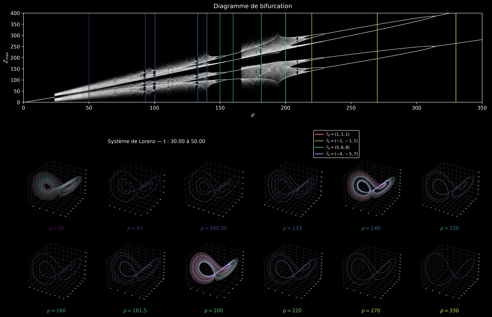

# Lorenz System: Bifurcations and Sonification

An independent exploration of the Lorenz system through numerical simulations, trajectory visualisation, and sound. 

## 1. Bifurcation Diagram

To explore how the system changes with the parameter $\rho\$, I numerically integrate trajectories for a range of values of $\rho\$. After discarding an initial transient, I record the local maxima of \(z(t)\) and plot them against $\rho\$.

This plot helps identify parameter ranges with different long-term behaviour. A finite set of recurring \(z\)-maxima can suggest a periodic orbit, which can then be examined by plotting the corresponding trajectory. The figure below shows the maxima plot alongside trajectories for selected values of $\rho\$.

## 2. Polyrhythmic Lorenz Orchestra

This experiment turns simulated Lorenz trajectories into an audiovisual animation. Several trajectories, computed with different values of $\rho\$, evolve side by side. Their motion is mapped to sound, so each trajectory contributes a changing tone to the combined audio.

The video lets you see and hear how the trajectories evolve together.

<!-- Paste here the video URL generated by dragging the video into GitHub's README editor. -->

https://github.com/user-attachments/assets/8e7c7543-2e2b-414b-bb96-57fb6030cfa5

